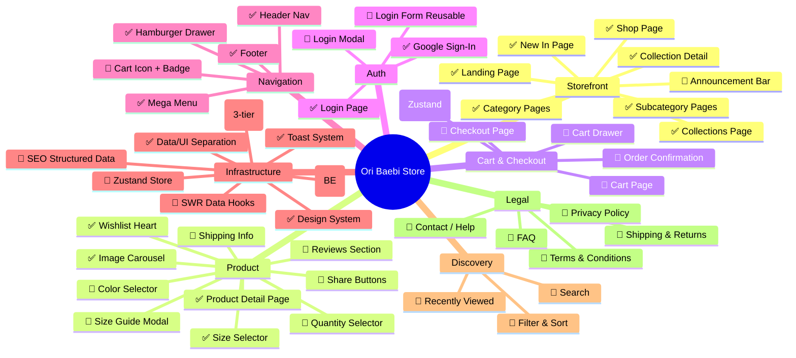
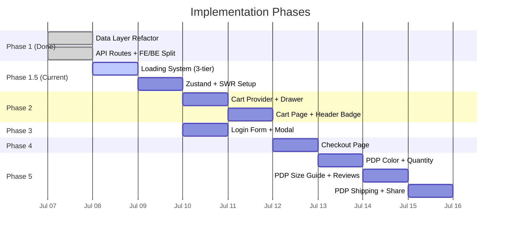

# Ori Baebi — Development Progress & Feature Roadmap

> Last updated: 2026-07-07

---

## Overall Progress

```
Core E-Commerce  ██████████████░░░░░░  68% (17/25 features)
Full Store        █████████░░░░░░░░░░░  40% (17/43 features)
```

| Category | Done | In Progress | Planned | Total |
|----------|------|-------------|---------|-------|
| **Storefront & Navigation** | 7 | 0 | 1 | 8 |
| **Product Experience** | 4 | 0 | 6 | 10 |
| **Cart & Checkout** | 0 | 0 | 5 | 5 |
| **Auth & Account** | 2 | 0 | 2 | 4 |
| **Infrastructure** | 4 | 1 | 3 | 8 |
| **Search & Discovery** | 0 | 0 | 3 | 3 |
| **Legal & Support** | 0 | 0 | 5 | 5 |
| **Totals** | **17** | **1** | **25** | **43** |

---

## Architecture Diagram

```mermaid
graph TB
    subgraph "Shared Types (src/types/)"
        T_PROD["product.ts"]
        T_CAT["category.ts"]
        T_COL["collection.ts"]
        T_REV["review.ts"]
        T_SIZE["size-guide.ts"]
        T_SHIP["shipping.ts"]
        T_API["api.ts"]
    end

    subgraph "BE — API Routes (src/app/api/)"
        API_PROD["/api/products"]
        API_PROD_ID["/api/products/[id]"]
        API_CAT["/api/categories"]
        API_COL["/api/collections"]
        API_REV["/api/reviews/[productId]"]
        API_SIZE["/api/size-guides/[category]"]
        API_SHIP["/api/shipping"]
    end

    subgraph "FE — Bridge"
        FETCHERS["server-fetchers.ts<br/>(fetch via HTTP)"]
        SWR["SWR / Client Hooks<br/>(planned)"]
    end

    subgraph "FE — Pages (App Router)"
        HOME["/ Landing"]
        SHOP["/shop"]
        CAT["/shop/[category]"]
        SUBCAT["/shop/.../[subcategory]"]
        PDP["/shop/.../[productId]"]
        COLLECTIONS["/collections"]
        COLDETAIL["/collections/[slug]"]
        NEWIN["/new-in"]
        CART_PAGE["/cart"]
        CHECKOUT["/checkout"]
    end

    subgraph "FE — Loading System (planned)"
        LOAD_SCREEN["Page Transition<br/>Branded Loading"]
        LOAD_SHIMMER["Card Shimmer"]
        LOAD_SPINNER["Lazy Load Spinner"]
    end

    subgraph "FE — State (planned)"
        ZUSTAND["Zustand Store<br/>(cart, user, wishlist)"]
    end

    subgraph "FE — Global Providers (layout.tsx)"
        TOAST["ToastProvider"]
    end

    T_PROD & T_CAT & T_COL & T_REV & T_SIZE & T_SHIP -.->|"import type"| API_PROD & API_CAT & API_COL & API_REV & API_SIZE & API_SHIP
    T_PROD & T_CAT & T_COL -.->|"import type"| FETCHERS

    FETCHERS -->|"fetch()"| API_PROD & API_CAT & API_COL
    FETCHERS --> HOME & SHOP & CAT & SUBCAT & PDP & COLLECTIONS & COLDETAIL & NEWIN

    SWR -.->|"fetch()"| API_PROD & API_REV & API_SIZE & API_SHIP

    LOAD_SCREEN -.-> HOME & SHOP & CAT & COLDETAIL
    LOAD_SHIMMER -.-> PDP
    LOAD_SPINNER -.-> SHOP

    ZUSTAND -.-> CART_PAGE & PDP & CHECKOUT

    style API_PROD fill:#C9A96E,color:#0A0A08
    style API_CAT fill:#C9A96E,color:#0A0A08
    style API_COL fill:#C9A96E,color:#0A0A08
    style API_REV fill:#C9A96E,color:#0A0A08
    style API_SIZE fill:#C9A96E,color:#0A0A08
    style API_SHIP fill:#C9A96E,color:#0A0A08
    style FETCHERS fill:#A3B18A,color:#0A0A08
    style ZUSTAND fill:#8FA3B4,color:#fff
    style SWR fill:#8FA3B4,color:#fff
    style LOAD_SCREEN fill:#B8A5C8,color:#0A0A08
    style LOAD_SHIMMER fill:#B8A5C8,color:#0A0A08
    style LOAD_SPINNER fill:#B8A5C8,color:#0A0A08
```



**Legend:**
- 🟡 Gold = BE API Routes (data inline, self-contained)
- 🟢 Green = FE Bridge (server-fetchers, fetch via HTTP)
- 🔵 Blue = Planned state management (Zustand + SWR)
- 🟣 Purple = Loading system

---

## Loading & UX Strategy

### 3-Tier Loading System

| Tier | Khi nào | Hiển thị | Mục đích |
|------|---------|----------|----------|
| **Page Transition** | Chuyển trang cần fetch data | Branded loading screen (logo + animation) | Không bị nhảy layout, chuyên nghiệp |
| **Card Shimmer** | Card/item đang load | Ánh sáng xẹt qua card placeholder | Giữ layout ổn định |
| **Lazy Spinner** | Load thêm items (infinite scroll) | Spinner nhỏ ở cuối list | Không block giao diện |

### State Management — Zustand + SWR (Recommended)

| Tool | Vai trò | Tại sao |
|------|---------|---------|
| **Zustand** (~3KB) | Global state: cart, wishlist, user | Nhẹ hơn Redux 4x, không cần Provider, persist built-in |
| **SWR** (~4KB) | API data cache + background refetch | `staleWhileRevalidate`: show cache ngay → fetch ngầm update |

**Flow khi user navigate:**
1. Lần đầu vào trang → Branded loading screen → Fetch data → Render
2. Quay lại trang đã xem → **Show cached data ngay** (0ms) → SWR fetch ngầm update
3. Data chưa thay đổi → Không re-render (SWR so sánh response)
4. Data thay đổi → Smooth update, không loading

### Tại sao không Redux?
- Redux yêu cầu nhiều boilerplate (actions, reducers, slices, Provider)
- Bundle ~13KB vs Zustand ~3KB
- Cần `redux-persist` thêm cho localStorage
- Overkill cho quy mô hiện tại
- Zustand + SWR = đủ powerful, ít code hơn 70%

---

## Feature Map



---

## Detailed Feature Status

### ✅ DONE (17 features)

| # | Feature | Type | Files |
|---|---------|------|-------|
| 1 | Landing Page | CORE | `landing-page/page.tsx`, hero, collection showcase |
| 2 | Shop Page | CORE | `shop/page.tsx`, category grid with GSAP |
| 3 | Category Pages | CORE | `shop/[category]/page.tsx`, hero, subcategory chips |
| 4 | Subcategory Pages | CORE | `shop/[category]/[subcategory]/page.tsx` |
| 5 | Product Detail Page | CORE | PDP with gallery, sizes, add to bag, wishlist, details, related |
| 6 | Image Carousel | CORE | Swipe/drag/arrows/dots/keyboard in PDP |
| 7 | Size Selector | CORE | From product data, per-product sizes |
| 8 | Collections Page | CORE | Horizontal scroll + editorial spreads |
| 9 | Collection Detail | CORE | Editorial lookbook layout |
| 10 | New In Page | CORE | Latest products grid |
| 11 | About Page | EXTRA | Brand story |
| 12 | Login Page | CORE | Google Sign-In |
| 13 | Header + Mega Menu | CORE | Desktop nav, hover mega menu |
| 14 | Hamburger Drawer | CORE | Mobile nav, accordion categories |
| 15 | Toast System | CORE | Global reusable, 4 variants, portal |
| 16 | Design System | CORE | CSS tokens, typography, spacing |
| 17 | Footer | CORE | Site footer |
| 18 | API Routes (BE) | CORE | 7 routes, data inline, self-contained |
| 19 | Data/UI Separation | CORE | FE/BE hoàn toàn tách biệt, shared types only |

### 🔄 IN PROGRESS

| # | Feature | Phase | Status |
|---|---------|-------|--------|
| 1 | Loading System (3-tier) | Infra | Shimmer CSS done, strategy defined, implementation pending |

### 🔲 PLANNED — Next Phases

| # | Feature | Phase | Type | Priority |
|---|---------|-------|------|----------|
| 1 | Zustand Store | Infra | CORE | 🔴 High |
| 2 | SWR Data Hooks | Infra | CORE | 🔴 High |
| 3 | Branded Page Loading | Infra | CORE | 🔴 High |
| 4 | Cart Provider (Zustand) | Cart | CORE | 🔴 High |
| 5 | Cart Drawer | Cart | CORE | 🔴 High |
| 6 | Cart Page | Cart | CORE | 🔴 High |
| 7 | Cart Icon + Badge | Cart | CORE | 🔴 High |
| 8 | Login Form (reusable) | Auth | CORE | 🔴 High |
| 9 | Login Modal | Auth | CORE | 🔴 High |
| 10 | Checkout Page | Checkout | CORE | 🔴 High |
| 11 | Color Selector | PDP | CORE | 🟡 Medium |
| 12 | Quantity Selector | PDP | CORE | 🟡 Medium |
| 13 | Size Guide Modal | PDP | EXTRA | 🟡 Medium |
| 14 | Reviews Section | PDP | EXTRA | 🟡 Medium |
| 15 | Shipping Info | PDP | EXTRA | 🟡 Medium |
| 16 | Share Buttons | PDP | EXTRA | 🟢 Low |

### 🔮 FUTURE — Roadmap

| # | Feature | Type | Priority |
|---|---------|------|----------|
| 1 | Search | CORE | 🔴 High |
| 2 | Filter & Sort | CORE | 🔴 High |
| 3 | Wishlist Page | CORE | 🟡 Medium |
| 4 | User Account | CORE | 🟡 Medium |
| 5 | Newsletter | EXTRA | 🟡 Medium |
| 6 | Product Zoom | EXTRA | 🟡 Medium |
| 7 | Announcement Bar | EXTRA | 🟢 Low |
| 8 | SEO Structured Data | CORE | 🟡 Medium |
| 9 | Sitemap + robots.txt | CORE | 🟡 Medium |
| 10 | Recently Viewed | EXTRA | 🟢 Low |
| 11 | Stock/Inventory UI | CORE | 🟡 Medium |
| 12 | Promo/Discount Codes | EXTRA | 🟢 Low |
| 13 | Order Confirmation | CORE | 🟡 Medium |
| 14 | Multi-currency | EXTRA | 🟢 Low |
| 15 | Privacy Policy | CORE | 🟡 Medium |
| 16 | Terms & Conditions | CORE | 🟡 Medium |
| 17 | Shipping & Returns | CORE | 🟡 Medium |
| 18 | Contact / Help | EXTRA | 🟢 Low |
| 19 | FAQ | EXTRA | 🟢 Low |

---

## Execution Timeline



---

## Tech Stack

| Layer | Technology |
|-------|-----------|
| Framework | Next.js 15 (App Router, Turbopack) |
| Language | TypeScript |
| Styling | Vanilla CSS + Design System Tokens |
| Layout Utilities | TailwindCSS (layout/spacing only) |
| Animations | GSAP (scroll), Framer Motion (transitions) |
| Fonts | Quiche Display (editorial), Inter Tight (UI) |
| State (planned) | Zustand (global), SWR (API cache) |
| Persistence | localStorage via Zustand persist |
| Auth | Google Sign-In (mock — no backend yet) |
| API | Next.js API Routes (self-contained, data inline) |
| Types | Shared `src/types/*` (FE + BE) |

---

## FE/BE Separation

```
src/
├── types/              ← SHARED (interfaces only, no data)
│   ├── product.ts
│   ├── category.ts
│   ├── collection.ts
│   ├── review.ts
│   ├── size-guide.ts
│   ├── shipping.ts
│   └── api.ts
│
├── app/api/            ← BE (data inline, self-contained)
│   ├── products/
│   ├── categories/
│   ├── collections/
│   ├── reviews/
│   ├── size-guides/
│   └── shipping/
│
└── app/(public)/       ← FE (fetch via HTTP, types only)
    └── shop/_data/
        └── server-fetchers.ts  ← Single bridge file (change BASE_URL for real BE)
```

**Khi chuyển sang BE riêng:** Chỉ đổi `BASE_URL` trong `server-fetchers.ts`.
